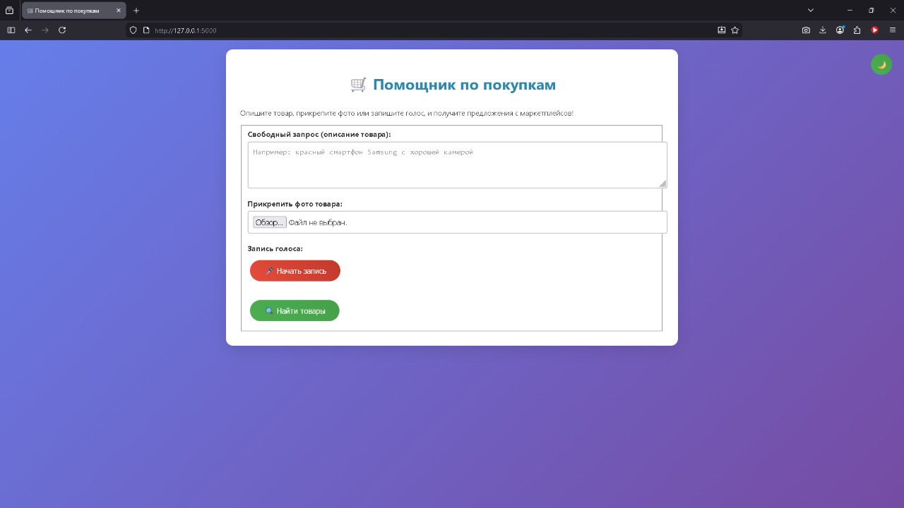
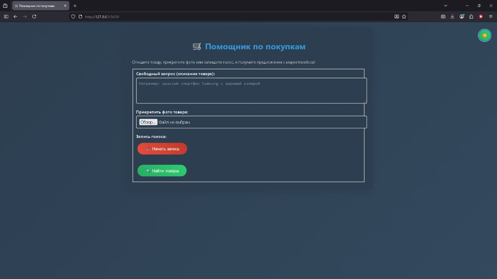
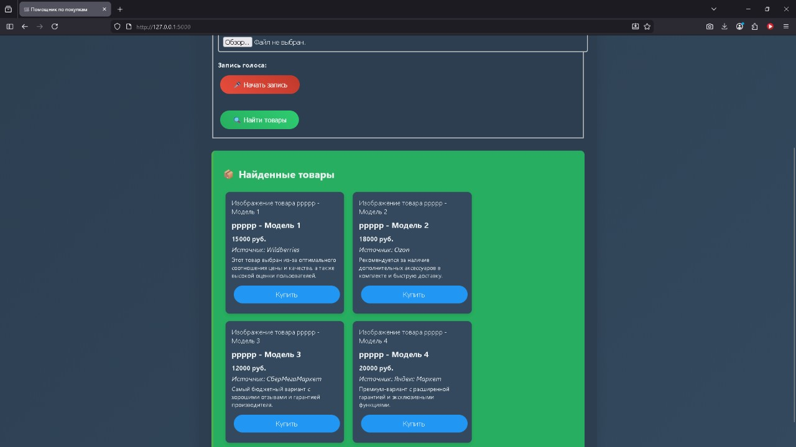

# Помощник по покупкам

⚠️ **Это прототип интерфейса, сервис пока не работает.**

Это реализация первых шагов MVP сервиса анализа товаров маркетплейсов.

## Установка и запуск

1. Установите зависимости: `pip install -r requirements.txt`
2. Скопируйте файл `.env.example` в `.env` и укажите API-ключи.
3. Запустите приложение: `python main.py`

## Функциональность

- сбор данных с Wildberries, Ozon, СберМегаМаркет, Яндекс Маркет;
- базовый анализ данных с использованием LLM (OpenAI).

## Подробная реализация интерфейса и логики

### Общее описание интерфейса

Главная страница представляет собой веб-приложение на Flask с адаптивным дизайном. Интерфейс включает:

- **поле для свободного запроса** — текстовое поле для ввода описания желаемого товара (например, «красный смартфон Samsung с камерой 50 MP»);
- **прикрепление фото** — input для загрузки изображения товара (JPEG/PNG), которое пользователь может прикрепить для уточнения запроса;
- **запись голоса** — кнопка для записи аудио через браузер (используя Web Audio API); аудиофайл прикрепляется к запросу. Для простоты аудио сохраняется как файл и может быть обработано позже (например, для распознавания речи);
- **кнопка отправки** — после ввода данных отправляет запрос на сервер;
- **вывод результатов** — после обработки отображаются примеры карточек товаров с маркетплейсов (симуляция реальных данных).

Дизайн должен соответствовать лучшим практикам цифровой доступности (WCAG 2.2 и опыт пользователей).

### Логика работы

#### 1. Ввод данных пользователем

- пользователь открывает главную страницу (http://127.0.0.1:5000/);
- вводит текст в поле запроса;
- опционально загружает фото (file input, сохраняется на сервере в папку `uploads/`);
- опционально записывает голос (JavaScript для записи аудио, сохраняется как `.wav` или `.webm` в `uploads/`);
- нажимает «Отправить запрос».

#### 2. Обработка на сервере (Flask)

- **приём данных** — Flask получает POST-запрос с текстом, файлом фото и файлом аудио;
- **валидация** — проверяет, что хотя бы текст введён; если фото или аудио присутствуют, они сохраняются;
- **симуляция обработки**:
  - текст запроса используется как основа для генерации фиктивных товаров;
  - фото пока не обрабатывается (заглушка), но сохраняется для будущего анализа (например, через компьютерное зрение);
  - аудио пока не транскрибируется (заглушка), но сохраняется для будущего распознавания речи (например, через Whisper API);
- **генерация результатов** — создаются 3–5 фиктивных карточек товаров на основе запроса (например, если запрос «смартфон», отображаются разные модели с ценами и источниками);
- **вывод** — рендерится страница с результатами.

#### 3. Вывод результатов

- **карточки товаров** — каждая карточка включает:
  - изображение (фиктивное или placeholder);
  - название товара;
  - обоснование выбора;
  - цену;
  - источник (Wildberries, Ozon и т. д.);
  - кнопку «Купить» (ссылка-заглушка);
- **дополнительно** — самый дешёвый товар выделяется, отображается таблица сравнения;
- при ошибке (нет данных) выводится сообщение.

#### 4. Техническая реализация

- **Frontend** — HTML с inline CSS и JavaScript для записи аудио:
  - JavaScript: `navigator.mediaDevices.getUserMedia()` для доступа к микрофону, запись через `MediaRecorder`, отправка как `Blob`;
- **Backend** — Flask-роут `/` для GET (форма) и POST (обработка):
  - сохранение файлов — папка `uploads/`;
  - симуляция данных — фиктивные словари товаров;
- **безопасность** — базовая, без валидации файлов (для MVP);
- **расширения** — в будущем: обработка фото (OCR, image search), транскрибация аудио (Whisper), реальный сбор данных с маркетплейсов.

#### 5. Файловая структура

- `main.py` — Flask-приложение;
- `templates/` — при необходимости (сейчас используется inline HTML);
- `uploads/` — для фото и аудио;
- `static/` — для CSS/JS, если потребуется вынести их отдельно.

#### 6. Тестирование

- запустить сервер, ввести запрос, загрузить файлы, проверить вывод карточек;
- проверить интерфейс на мобильных устройствах (адаптивность).

Эта реализация является заглушкой для MVP и фокусируется на UI/UX, с возможностью расширения до полноценной функциональности.

## Скриншоты

